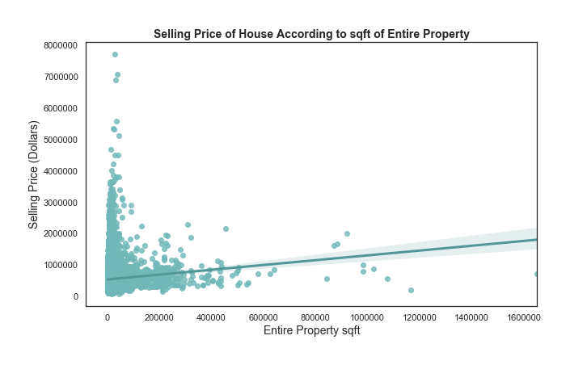

# Housing Price Prediction Model

## Respository Contents
* `visualizations`: folder with graphs used in README.md
* `predict_holdout.ipynb`: Jupyter notebook used to generate predictions using final model on testing data from `kc_house_data_houldout_features.csv`
* `README.md`: public-facing text file that's previewed on github repository
* `draft_process.ipynb`: scrap Jupyter notebook used to experiment with modeling process, using training data from `kc_house_data_train.csv`
* `final_model_process.ipynb`: **final Jupyter notebook** with 'cleaned up' modeling process, to be submitted for review
* `housing_preds_sidney_kung`: final CSV file of housing price predictions on holdout set
* `kc_house_data_houldout_features.csv`: CSV file with **testing data**, pre-split from dataset of King County housing information
* `kc_house_data_train.csv`: CSV file with **holdout data**, pre-split from dataset of King County housing information
* `model.pickle`: pickle file with final model

## Overview

This project builds a model to predict how much someone will pay for a house in King County Seatle, Washington. Inital exploratory data analysis shows the higher the interior sqft, the higher the selling price. Also, the least profitable on average in February. It's the most profitable to sell a house in April to June. Additionally, the proprty size does not determine whether a house sells for higher.

Based on that discovery, the model included those features to determine house prices based on unseen data. Each iteration of the model used feature selection to determine which model predict most accurately. After three iterations, the final model has an RMSE of 217282.329, when predicting on testing data that was split from `kc_house_data_train.csv'. The final model's predictions on the holdout set can be found in housing_preds_sidney_kung.csv.

## Business Questions
Before building the model, I investigated three main questions through exploratory data analysis.
1. Do houses sell for more money when they have more interior sqft space?
2. On average, what is the most profitable month to sell a house?
3. Do houses with higher proprty size sell for more?

## Data & Methods

This model has been developed by using the traing set, `kc_house_data_train.csv`. It was then predicted on the `kc_house_data_holdout_features.csv`. The resulting dataframe has been saved as `housing_preds_sidney_kung.csv`.

The overall data set contains information about houses that were sold in King County in Seattle, Washington during the last decade. Below is a description of the column names, to help gain a better understanding about what the data represents. 

| column name | description |
|-|-|
| **id** | unique ID for each home |
| **date** | date the home was sold |
| **price** | selling price of each home |
| **bedrooms** | number of bedrooms |
| **bathrooms** | number of bathrooms, where .5 accounts for a room with a toilet but no shower |
| **sqft_living** | square footage of each home's interior living space |
| **sqft_lot** | square footage of each home's land space |
| **floors** | number of floors (levels) in house |
| **waterfront** | dummy varibale for whether the home is overlooking the waterfront or not |
| **view** | rating of home's view, on a scale of 0 to 4 |
| **condition** | overall condition of each home, on a scale of 1 to 5 |
| **grade** | overall grade given to each home, on a scale of 1 to 13, based on King County grading system. 1-3 falls short of buidling construction and design, 7 has an average level of construction and design, and 11-13 has a high quality level of construction and design |
| **sqft_above** | square footage of the interior housing space, excluding basement |
| **sqft_basement** | square footage of the basement |
| **yr_built** | year that each home was built |
| **yr_renovated** | year of each home's last renovation |
| **zipcode** | zip code in which home is located |
| **lat** | latitude coordinate |
| **long** | longitude coordinate |
| **sqft_living15** | square footage of interior housing living space for the nearest 15 neighbors |
| **sqft_lot15** | square footage of the land lots of the nearest 15 neighbors |

## Results

During the exploratory data analysis phase, I discovered that the 'sqft_living' and 'price' have a highly positive correlation. Therefore, the higher the interior sqft, the higher the selling price.

Additioanlly, by looking at the average price per month, it's clear that the least profitable month on average is February. Meanwhile, it's the most profitable to sell a house in April to June.

Finally, it was discovered that the entire property size does not determine whether a house sells for higher

## Final Model Performance

After three iterations, the final model was able to generate an RMSE of 217282.329 when predicting on testing data that was split from `kc_house_data_train.csv'. Although this RMSE is not ideally low enough, it's a great start for my first attempt at machine leanring modeling. My last iteration out of the three ended up being the best. The final model's predictions on the blind holdout set can be found in housing_preds_sidney_kung.csv.

## For More Information

See the [full model process](https://github.com/sidneykung/Housing_Price_Model/blob/master/modeling_process.ipynb) in a Jupyter Notebook, named `final_model_process.ipynb`, located in this repository.

For additional info, contact Sidney Kung at sidneyjkung@gmail.com