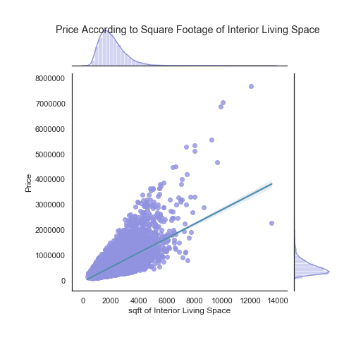
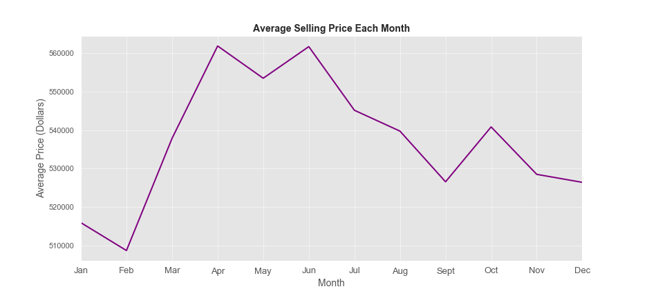

# Housing Price Prediction


## Overview

This project builds a linear regression model to predict how much someone will pay for a house in King County Seattle, Washington. Initial exploratory data analysis shows the higher the interior sqft, the higher the selling price. Also, the total property size does not determine whether a house sells for higher. Finally, the least profitable month to see a house on average is February. It's actually the most profitable in April to June. 

Based on that discovery, the model included those features to determine house prices based on unseen data. Each iteration of the model used feature selection to determine which model predicted most accurately. After three iterations, the final model has an **RMSE of 214529.8727, when predicting on testing data** that was split from `kc_house_data_train.csv'. The final model's predictions on the holdout set can be found in `housing_predictions.csv`.

## Business Questions
Before building the model, three main questions were investigated through exploratory data analysis.
1. Do houses sell for more money when they have more interior sqft space?
2. Do houses with higher total property size sell for more?
3. On average, what is the most profitable month to sell a house?

## Data & Methods

This model has been developed by using the training set, `kc_house_data_train.csv`. It was then predicted on the `kc_house_data_holdout_features.csv`. The resulting dataframe with price predictions has been saved as `housing_predictions.csv`.

The overall data set contains information about **houses that were sold in King County Seattle, Washington during the last decade**. Below is a description of the column names, to help gain a better understanding about what the raw data represents. 

| column name | description |
|-|-|
| **id** | unique ID for each home |
| **date** | date the home was sold |
| **price** | selling price of each home |
| **bedrooms** | number of bedrooms |
| **bathrooms** | number of bathrooms, where .5 accounts for a room with a toilet but no shower |
| **sqft_living** | square footage of each home's interior living space |
| **sqft_lot** | square footage of each home's land space |
| **floors** | number of floors (levels) in house |
| **waterfront** | dummy varibale for whether the home is overlooking the waterfront or not |
| **view** | rating of home's view, on a scale of 0 to 4 |
| **condition** | overall condition of each home, on a scale of 1 to 5 |
| **grade** | overall grade given to each home, on a scale of 1 to 13, based on King County grading system. 1-3 falls short of building construction and design, 7 has an average level of construction and design, and 11-13 has a high quality level of construction and design |
| **sqft_above** | square footage of the interior housing space, excluding basement |
| **sqft_basement** | square footage of the basement |
| **yr_built** | year that each home was built |
| **yr_renovated** | year of each home's last renovation |
| **zipcode** | zip code in which home is located |
| **lat** | latitude coordinate |
| **long** | longitude coordinate |
| **sqft_living15** | square footage of interior housing living space for the nearest 15 neighbors |
| **sqft_lot15** | square footage of the land lots of the nearest 15 neighbors |


## Results

During the exploratory data analysis phase, I discovered that the `sqft_living` and `price` have a highly positive correlation. Therefore, the higher the interior sqft, the higher the selling price.




Additionally, it was discovered that the total property size does not determine whether a house sells for higher.


Finally, by looking at the average price per month, it's clear that the least profitable month on average is February. Meanwhile, it's the most profitable to sell a house in April to June.



## Final Model Performance

After three iterations, the final Linear Regression model was able to generate an RMSE of 214529.8727 when predicting on testing data that was split from `kc_house_data_train.csv`. The final model's predictions on the blind holdout set can be found in `housing_predictions.csv`.

## Next Steps

- Feature engineering with polynomials, log transformations and interactions
- Feature selection with recursive feature elimination (RFE) and other techniques
- Generalize improved final model on holdout set

## Repository Contents

```bash
.
├── notebooks                       # contains modeling notebooks
│   └── predict_holdout.csv         # generating predictions using final model
├── pickle                          # contains final model
├── src                             # source folder
│   └── kc_house_data_train.csv     # pre-split raw dataset
├── visualizations                  # contains graphs and images
├── README.md                       # public-facing preview
└── final_model_process.ipynb       # final version of EDA, feature engineering and modeling process

```

## For More Information
- See the [full project overview](https://github.com/sidneykung/Housing_Price_Model/blob/main/final_model_process.ipynb) in the `final_notebook.ipynb` Jupyter Notebook.
- For additional information or suggestions, contact Sidney Kung at [sidneyjkung@gmail.com](mailto:sidneyjkung@gmail.com)

**Let's connect!**

- [LinkedIn](https://www.linkedin.com/in/sidneykung/)

- [Twitter](https://twitter.com/sidney_k98)
